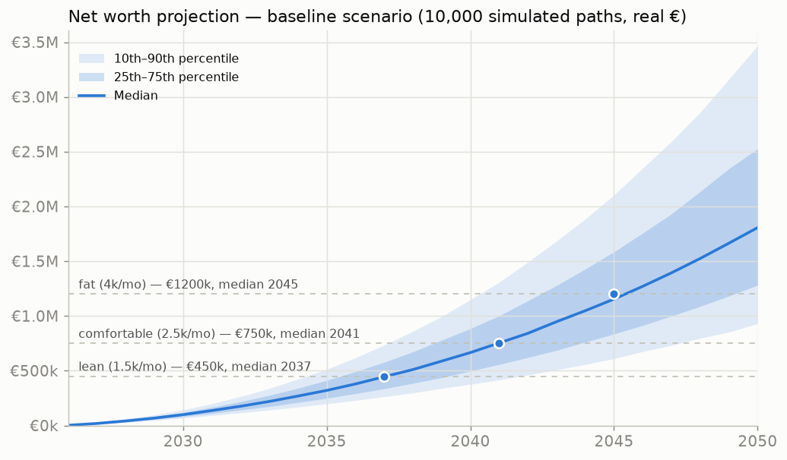
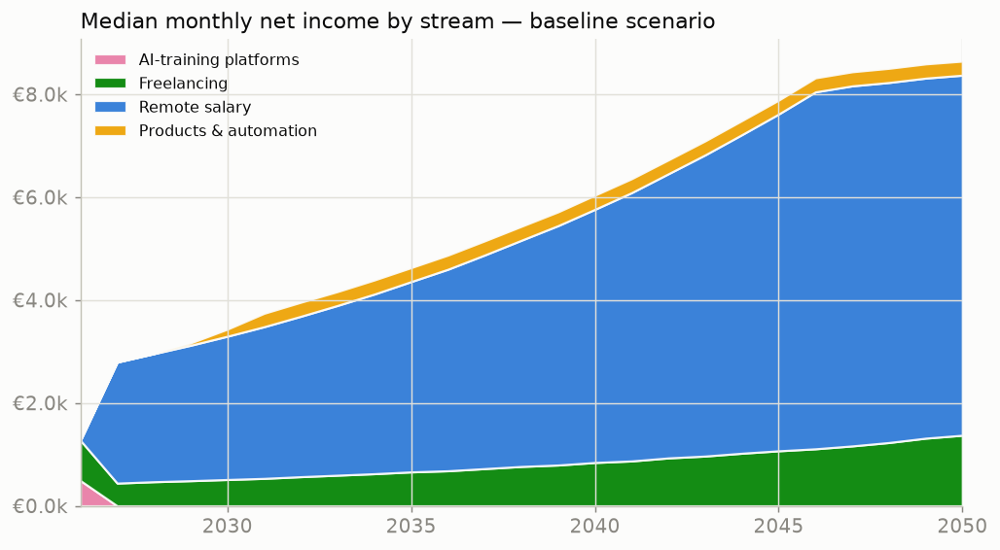
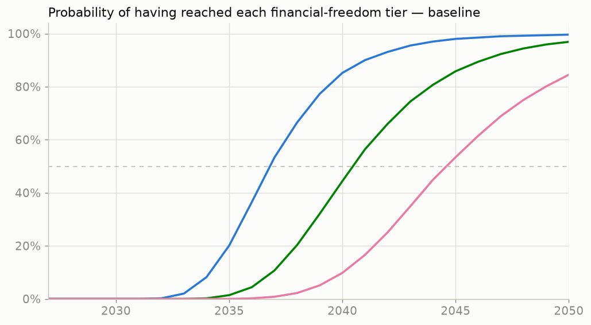
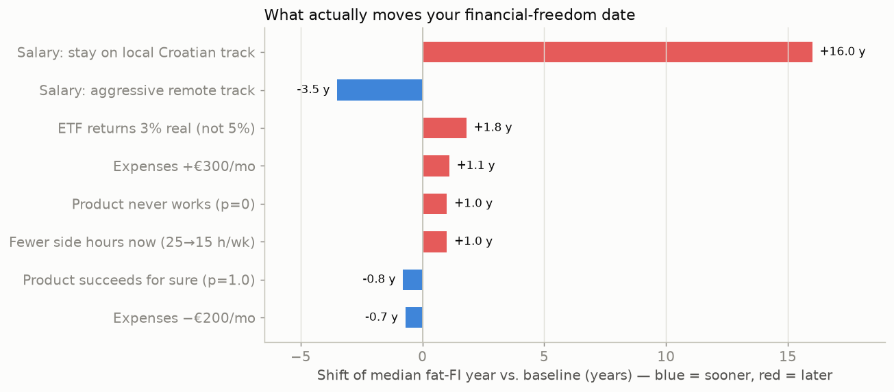

# Life & Work Plan — Statistical Path to Financial Freedom

*Simulated 19 July 2026 · 10,000 Monte Carlo paths × 25 years, monthly resolution, real (inflation-adjusted) EUR · model: [`lifeplan/model.py`](lifeplan/model.py) · data: [`data/lifeplan/results.json`](data/lifeplan/results.json) · interactive version on the [dashboard site](site/lifeplan.html)*

---

## The headline, in one paragraph

Starting from where you are today — geodesy Master's student, ~1 year to graduation, €700/mo expenses, €0 saved, 25 h/wk available — the model says: **lean financial independence (€1,500/mo passive, €450k portfolio) is close to certain, median 2037**, age ~35 if you're ~24 now. **Comfortable FI (€2,500/mo, €750k) has a 97% lifetime probability, median 2041.** Your chosen target — **fat FI at €4,000/mo (€1.2M) — is likelier than not (87% lifetime), median 2045**, a coin-flip by 2045 and 85% by 2050. And the single decision that dominates everything, worth **±16 years**, is not the side hustles, not the product, not even the market: it's **whether you land and keep a remote-EU-level salary instead of a local Croatian one.**

---

## 1. Where you are now (model inputs)

| Input | Value | Source |
|---|---|---|
| Status | Master's, geodesy & geoinformatics, graduating ~07/2027 | you |
| Time available | 25+ h/wk until graduation | you |
| Expenses | €700/mo now → €1,100/mo independent (+€200 step 2032, +1.5%/yr) | you (€500–900 band) |
| Savings | ≈ €0, surplus → global ETF, 5% real return, 15% vol | you; Croatian 2-yr-holding tax exemption |
| FI target | €4,000/mo ⇒ €1.2M at 4% SWR (tiers €450k / €750k also tracked) | you |
| Skills/assets | Python, scraping, GitHub Actions ([pokusaj](https://github.com/grgurgemini-spec/pokusaj)), photogrammetry, QGIS, Sentinel-2 · a **live automated EO product** ([eo-monitor](https://grgurgemini-spec.github.io/financial-research-/eo-monitor/)) | this repo |

Income distributions come from the [research phase](REPORT.md) (25 scored opportunities, `data/opportunities.json`); every assumption is in the `ASSUMPTIONS` dict of [`lifeplan/model.py`](lifeplan/model.py) — change any number and re-run.

## 2. The projection

**Baseline scenario medians:** net worth ≈ **€99k by 2030 → €320k by 2035 → €665k by 2040 → €1.15M by 2045**. Median monthly net income: €2,840 in 2027 → €3,630 in 2030 → €5,010 in 2035, with a savings rate settling around **60–70%** — that savings rate, not investment genius, is the engine of the whole plan.

### Probability of reaching each FI tier (baseline)

| Tier | Portfolio | Lifetime prob. | Median year | 10%-lucky year | 90%-unlucky year |
|---|---|---|---|---|---|
| Lean (€1.5k/mo) | €450k | **99.6%** | **2037** | 2035 | 2041 |
| Comfortable (€2.5k/mo) | €750k | **97.4%** | **2041** | 2037 | 2046 |
| Fat (€4k/mo) | €1.2M | **86.5%** | **2045** | 2040 | beyond 2051 |

### Scenarios

| Scenario | Lean median | Comfortable median | Fat median | Fat lifetime prob. |
|---|---|---|---|---|
| **Baseline** (remote job + side income + product) | 2037 | 2041 | 2045 | 86.5% |
| **No product** (job + freelancing only) | 2038 | 2042 | 2046 | 81.7% |
| **Aggressive** (top-quartile remote salary, product works) | 2035 | 2038 | **2042** | 98.3% |
| **Croatia-local salary** (everything else identical) | 2042 | 2047 | — (never, for most paths) | **41.8%** |

## 3. What actually moves the date

The sensitivity analysis is the most important chart in this repo:

1. **Salary track is 5–15× more powerful than everything else.** Staying on a local Croatian salary (€1,500 net start, capped ~€3,500) pushes fat FI out by **+16 years** and cuts its lifetime probability to 42%. Going hard for a top-quartile remote track pulls it in by **−3.5 years**. Every hour spent making yourself remotely employable at EU rates outearns every other hour in this plan.
2. **Market returns you don't control (±~2 years).** 3% real instead of 5% costs +1.8y. Diversify, hold, ignore.
3. **Expenses (±~1 year per few hundred €/mo).** Lifestyle creep is a real but second-order tax on the date.
4. **The product and the side hustles (±~1 year each).** This surprised the model's author too: the EO SaaS succeeding vs. never existing moves the *median* date only ~1–2 years — **but** it drives the upside tail (it's a big reason the aggressive scenario hits 98%), it's your best resume artifact for the salary track (see #1), and it's the only stream that survives if you ever *stop* working. Build it for those reasons, not for the median.

## 4. The phase-by-phase playbook

### Phase 1 — Student year (now → mid-2027): build proof, bank the first €10k
*Model median: €700–1,900/mo net income ramping up; expenses €700.*
- **Weeks 1–2:** register on Outlier/DataAnnotation/Mindrift (STEM tiers → $20–40/hr); create the Upwork profile — niche: *geospatial automation & web scraping*; portfolio: pokusaj + eo-monitor (already live, already yours).
- **Months 1–6:** 10 h/wk platforms (immediate cash) + 15 h/wk freelancing ramp (automation + GEE/QGIS gigs). Build the 3 GEE portfolio demos along the way — client work *is* the portfolio.
- **Months 6–12:** shift hours from platforms toward freelancing as reviews accumulate; raise rates to €40+/hr. Ship one improvement to eo-monitor per month (alerts webhook, second product type, first free pilot user).
- **Finish the Master's.** The degree + the GitHub is the remote-job ticket. Thesis idea: the eo-monitor flood/snowmelt pipeline *is* a thesis.

### Phase 2 — The anchor job (2027 → 2029): the decision that's worth 16 years
*Model median: €2,800–3,600/mo net; savings rate >60%.*
- Target **remote EU geospatial data-engineer/EO roles** (€1,800–2,800 net start in the model; boards: Space-Careers, GEO CAREERS, EO-jobs list, EGU). Lead every application with the automation stack — a live, self-running EO product is something almost no graduate shows up with.
- **Do not settle into a local-salary track** — the model prices that decision at +16 years to fat FI. If a local job is the only option, treat it as a 12-month bridge and keep applying out.
- Register **paušalni obrt as druga djelatnost** (no monthly contributions; ~12% flat tax) the month side income becomes regular. Keep freelancing ~10 h/wk — client work compounds your rate and network.
- Automate investing: standing monthly ETF order the day salary lands. Target savings rate ≥60%.

### Phase 3 — Product years (2029 → 2032): convert skills into equity
*Model median: €4,000–5,000/mo net; product stream ramping on ~55% of paths.*
- Grow eo-monitor into the subscription service (vineyard NDVI reports, municipal flood alerts, €20–50/mo per client) — first 3 pilot clients free, then charge.
- **Kill criterion:** if the product is under ~€300 MRR after 18 months of honest effort (mid-2031), stop, keep it as portfolio, and redirect those hours to rate-raising or the salary track. The model says the median cost of it failing is ~1 year — don't let sunk cost make it 5.
- Salary: push for senior/architect scope (data pipelines, MLOps for EO). Job-hop if growth stalls; the model's 6%/yr real growth assumes you don't coast.

### Phase 4 — Compounding (2032+): protect the machine
*Model median: crossing lean FI ~2037, comfortable ~2041, fat ~2045.*
- The portfolio now does more work each year than new savings. The job is boring on purpose: keep the savings rate, keep the ETF, rebalance annually, ignore drawdowns (the model's paths include crashes; the medians already survived them).
- Lifestyle steps are pre-budgeted (+€200/mo from 2032). Each further +€300/mo of permanent spending costs ~+1 year — spend consciously, not accidentally.
- From lean FI (2037 median) onward, **work becomes optional in stages**: you can drop to part-time consulting at ~2041 (comfortable tier) with fat FI still arriving via compounding.

## 5. Decision gates (calendar reminders, literally)

| When | Gate | If failing |
|---|---|---|
| 2027-01 | Freelance ≥ €800/mo? | Rebalance hours toward whichever stream is paying; get 5 Upwork reviews before graduation |
| 2027-09 | Remote-level job offer in hand? | Take local bridge job, keep applying monthly — do not unpack there |
| 2029-06 | Savings rate ≥ 55%? | Audit expenses before blaming income |
| 2031-06 | Product ≥ €300 MRR? | Kill per criterion above, redirect hours |
| Every Dec | Re-run `lifeplan/model.py` with actuals | Update ASSUMPTIONS with your real numbers; the plan is a living model |

## 6. Honest caveats

- **A model is consequences of assumptions, not a forecast.** The income ranges come from research that skews optimistic (self-reported blog earnings); the model anchors on conservative mids, but the true uncertainty is wider than the fan.
- Simulated in **real (today's) euros** — the €1.2M target is today's purchasing power; nominal numbers will be larger.
- FI crossing = first touch of the threshold; sequence-of-returns risk around retirement is not separately modeled (the 4% SWR embeds the classic studies' version of it).
- Croatian tax rules (paušalni obrt 12%, €60k limit, ETF 2-year exemption) are 2026 rules and will change over 25 years. **Verify with an accountant; this is research, not financial or tax advice.**
- The single most fragile assumption is salary growth persistence. It's also the one you have the most agency over — which is rather the point of this plan.

---

*Regenerate everything: `python3 lifeplan/model.py && python3 lifeplan/charts.py` — edit `ASSUMPTIONS` in the model to match reality as it unfolds.*
